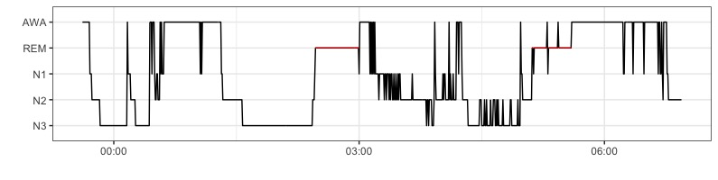

# Sleepr

Sleep analysis with R.

## Installation

Sleepr latest version can be directly installed from Github using the `devtools` package.

```
devtools::install_github("boupetch/sleepr")
```

## Usage

### File manipulation

In Sleepr, `write_mdf()` and `read_mdf()` functions are used to write and read records on disk. Files are converted from the European Data Format (EDF) to Morpheo Data Format (MDF). MDF<sup>1</sup> is a simple, efficient and interoperable file format for biological timeseries. The format supports raw signal as long as metadata storage. 
MDF uses binary files for signals and JSON for metadata. Signals values are encoded by default in binary, 32 bits, little endian.

### Events handling

### Data visualisation



### Statistics computing

Exemple

```R
library(sleepr)

write_mdf(edfPath = "tests/testthat/data/1/1.rec",
          mdfPath = "tests/testthat/data/1/1",
          events = read_events_isruc(
            dir = "tests/testthat/data/1/",
            scoringNum = 1))
            
record <- read_mdf("tests/testthat/data/1/1",
                   channels = "C3-A2")

hypnogram_band_powers(record,"C3-A2")
```

## Package Testing

Testing use [testthat](https://github.com/r-lib/testthat). Sample EDFs from open databases are downloaded first.

### Generating reference manual

```
R CMD Rd2pdf . && mv ..pdf sleepr.pdf && rm -r .Rd2pdf*
```

## References

1. P. Bouchequet, D. Jin, G. Solelhac, M. Chennaoui, D. Leger, [«*Morpheo Data Format (MDF), un nouveau format de données simple, robuste et performant pour stocker et analyser les enregistrements de sommeil*»](https://www.sciencedirect.com/science/article/pii/S1769449318301304), Médecine du Sommeil, vol. 15, n 1, p. 48‑49, march 2018.
