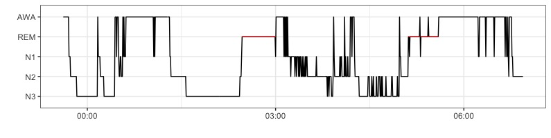
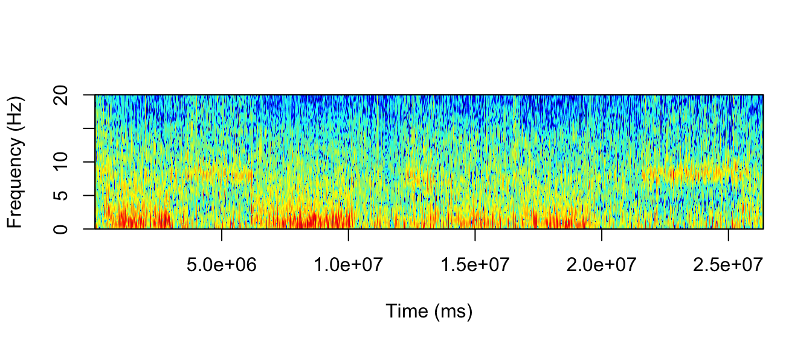

# Sleepr

[](https://travis-ci.org/boupetch/sleepr) [](https://codecov.io/gh/boupetch/sleepr) [](https://opensource.org/licenses/MIT)

Sleep analysis with R.

## Installation

Sleepr latest version can be directly installed from Github using the `devtools` package.

```
devtools::install_github("boupetch/sleepr")
```

## Usage

### File manipulation

In Sleepr, `write_mdf()` and `read_mdf()` functions are used to write and read records on disk. Files are converted from the European Data Format (EDF) to Morpheo Data Format<sup>1</sup> (MDF). MDF is a simple, efficient and interoperable file format for biological timeseries. The format supports raw signal as long as metadata storage. 
MDF uses binary files for signals and JSON for metadata.  Signals values are encoded by default in binary, 32 bits, little endian.

### Sleep visualization

#### Hypnogram

`plot_hypnogram()` function plots a hypnogram using `ggplot2`, higlighting `REM` sleep in red. The function takes as argument a dataframe containing labels, start and end times of events. AASM stages<sup>2</sup> with labels `AWA`,`REM`,`N1`,`N2`,`N3` by default. Labels can be redefined using the `labels` argument.



#### Spectrogram

A spectrogram visually represents the frenquencies spectrum of a signal. Spectrogram are widely used to visualize and analyse EEG.




### Statistics computing

Various statistics can be computed from the polysomnographic data, signals and events. Durations are expressed in *minutes*, indexes in *hours*. 

`compute_all_stats()` function call all the following functions over a vector of records paths. It returns a dataframe with a line for each record. EEG bands can be specified at this point to the `bands` argument.

```R
# Write record to disk from EDF to MDF
write_mdf("path/to/edf", "path/to/mdf")

# Compute all stats from the record
compute_all_stats("path/to/mdf", bands = list(
  delta = c(0.5,3.5),theta = c(3.5,8),alpha = c(8,12),
  beta = c(12,30),gamma1 = c(30,40),gamma2 = c(40,60)))
```

#### Stages & scoring

These functions compute statistics based on stage scoring.

  * `rem_duration`: Total duration of REM sleep in minutes.
  * `n1_duration`: Total duration of N1 sleep in minutes.
  * `n2_duration`: Total duration of N2 sleep in minutes.
  * `n3_duration`: Total duration of N3 sleep in minutes.
  * `awa_duration`: Total duration of wake in minutes.
  * `tts`: Time To Sleep (N1+N2+N3+REM durations) in minutes.
  * `rem_tts`: REM over TTS duration ratio.
  * `n3_tts`: N3 over TTS duration ratio.
  * `n2_tts`: N2 over TTS duration ratio.
  * `n1_tts`: N1 over TTS duration ratio.
  * `tsp`: Total Sleep Period.
  * `sleep_efficiency`: Sleep Efficiency.
  * `sleep_latency`: Sleep Latency.
  * `rem_latency`: REM Sleep Latency.
  * `waso`: Wake After Sleep Onset.
  
#### Position & activity

  * `tts_pos_back`: TTS duration in back position in minutes.
  * `tts_pos_back_pct`: TTS duration in back position over TTS duration.
  * `tts_pos_left`: TTS duration in left position in minutes.
  * `tts_pos_left_pct`: TTS duration in left position over TTS duration.
  * `tts_pos_right`: TTS duration in right position in minutes.
  * `tts_pos_right_pct`: TTS duration in right position over TTS duration.
  * `tts_pos_stomach`: TTS duration in left position in minutes.
  * `tts_pos_stomach_pct`: TTS duration in stomach position over TTS duration.
  * `tts_pos_nonback`: TTS duration in non-back position in minutes.
  * `tts_pos_nonback_pct`: TTS duration in non-back position over TTS duration.
  
#### Snoring

  * `snoring_count`: Snorings count.
  * `snoring_index`: Snoring count per hour.
  * `snoring_duration`: Total duration of snorings.
  * `snoring_duration_pct`: Total duration of snorings over TTS duration.
  
#### Respiratory indexes

  * `ah_count`: Apnea and hypopnea count.
  * `ah_hour`: 
  * `ah_back`:
  * `ah_nonback`:
  * `ah_rem`:
  * `ah_nonrem`:
  
#### Micro-arousals

  * `ma_count`:
  * `ma_index`:
  * `ma_duration`:
  * `ma_n1_duration`:
  * `ma_n2_duration`:
  * `ma_n3_duration`:
  * `ma_rem_duration`:
  * `ma_n1_count`:
  * `ma_n2_count`:
  * `ma_n3_count`:
  * `ma_rem_count`:
  * `ma_n1_index`:
  * `ma_n2_index`:
  * `ma_n3_index`:
  * `ma_rem_index`:

#### Rapid eye movements

  * `rem_count`: Count of Rapid-Eye-Movements.
  * `rem_index`:
  * `rem_avg_duration`:
  
#### Cycles

  * `cycles_classic_count`:
  * `cycles_begin_count`:
  * `cycles_end_count`:
  * `cycles_rem_count`:
  * `cycles_classic_duration`:
  * `cycles_begin_duration`:
  * `cycles_rem_duration`:
  * `cycles_end_duration`:
  * `cycles_classic_avg_duration`:
  * `cycles_begin_avg_duration`:
  * `cycles_rem_avg_duration`:
  * `cycles_end_avg_duration`:

## Package Testing

Testing use [testthat](https://github.com/r-lib/testthat).

### Generating Sleepr package reference manual

```
R CMD Rd2pdf . && mv ..pdf sleepr.pdf && rm -r .Rd2pdf*
```

## References

1. P. Bouchequet, D. Jin, G. Solelhac, M. Chennaoui, D. Leger, [«*Morpheo Data Format (MDF), un nouveau format de données simple, robuste et performant pour stocker et analyser les enregistrements de sommeil*»](https://www.sciencedirect.com/science/article/pii/S1769449318301304), Médecine du Sommeil, vol. 15, n 1, p. 48‑49, march 2018.

2. R.B. Berry, R. Brooks, C.E. Gamaldo, S.M. Harding, C.L. Marcus, B.V. Vaughn, [The AASM Manual for the Scoring of Sleep and Associated Events](https://aasm.org/clinical-resources/scoring-manual/), 2013.
