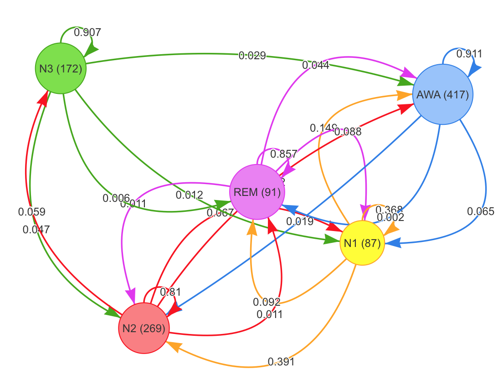

# Sleepr

[](https://travis-ci.org/boupetch/sleepr) [](https://codecov.io/gh/boupetch/sleepr) [](https://opensource.org/licenses/MIT)

Sleep analysis with R.

## Installation

SleepR latest version can be directly installed from Github using the `devtools` package.

```
devtools::install_github("boupetch/sleepr")
```

## Usage

### File manipulation

In SleepR, `write_mdf()` and `read_mdf()` functions are used to write and read records on disk. Files are converted from the European Data Format (EDF) to Morpheo Data Format<sup>1</sup> (MDF). MDF is a simple, efficient and interoperable file format for biological timeseries. The format supports raw signal and metadata storage. MDF uses binary files for signals and JSON for metadata.

### Sleep visualization

#### Hypnogram

`plot_hypnogram()` function plots a hypnogram using `ggplot2`, higlighting `REM` sleep in red. The function takes as argument a dataframe containing labels, start and end times of events. AASM stages<sup>2</sup> with labels `AWA`,`REM`,`N1`,`N2`,`N3` by default. Labels can be redefined using the `labels` argument.


#### Spectrogram

A spectrogram visually represents the frenquencies spectrum of a signal. Spectrogram are widely used to visualize and analyse EEG. `plot_spectrogram()` conveniently wrappers `phonTools` library `spectrogram` function to plot spectrograms.


#### Spectral powers

```R
record <- read_mdf("mdf/isruc-1-89-1/")

powers <- sleepr::hypnogram_band_powers(record = record,
                                        channel = "C3-M2")
powers$colors <- NA
powers$colors[powers$stage == "AWA"] <- "#1D60E7"
powers$colors[powers$stage == "REM"] <- "#D900F0"
powers$colors[powers$stage == "N1"] <- "#FD9509"
powers$colors[powers$stage == "N2"] <- "#F70007"
powers$colors[powers$stage == "N3"] <- "#339F03"
threejs::scatterplot3js(powers$delta, powers$theta,
                        as.integer(powers$epoch), size = 0.25,
                        color= powers$colors)
```


#### Transitions graph

```R
record <- read_mdf("/Users/paul/Documents/sleep/mdf/isruc-1-89-1/")

powers <- sleepr::hypnogram_band_powers(record = record,
                                        channel = "C3-M2")

sleepr::plot_transitions(record[["events"]])
```




### Statistics computing

Various statistics can be computed from the polysomnographic data, signals and events. Durations are expressed in *minutes*, indexes in *hours*. 

`compute_all_stats()` function call all the following functions over a vector of records paths. It returns a dataframe with a line for each record. EEG bands can be specified at this point to the `bands` argument.

```R
# Write record to disk from EDF to MDF
write_mdf("path/to/edf", "path/to/mdf")

# Compute all stats from the record
compute_all_stats("path/to/mdf", bands = list(
  delta = c(0.5,3.5), theta = c(3.5,8), alpha = c(8,12),
  beta = c(12,30), gamma1 = c(30,40), gamma2 = c(40,60)))
```

#### Stages & scoring

These functions compute statistics based on stage scoring.

  * `rem_duration`: Total duration of REM sleep in minutes.
  * `n1_duration`: Total duration of N1 sleep in minutes.
  * `n2_duration`: Total duration of N2 sleep in minutes.
  * `n3_duration`: Total duration of N3 sleep in minutes.
  * `awa_duration`: Total duration of wake in minutes.
  * `tts`: Time To Sleep (N1+N2+N3+REM durations) in minutes.
  * `rem_tts`: REM over TTS duration ratio.
  * `n3_tts`: N3 over TTS duration ratio.
  * `n2_tts`: N2 over TTS duration ratio.
  * `n1_tts`: N1 over TTS duration ratio.
  * `tsp`: Total Sleep Period.
  * `sleep_efficiency`: Sleep Efficiency.
  * `sleep_latency`: Sleep Latency.
  * `rem_latency`: REM Sleep Latency.
  * `waso`: Wake After Sleep Onset.
  
#### Position & activity

  * `tts_pos_back`: TTS duration in back position in minutes.
  * `tts_pos_back_pct`: TTS duration in back position over TTS duration.
  * `tts_pos_left`: TTS duration in left position in minutes.
  * `tts_pos_left_pct`: TTS duration in left position over TTS duration.
  * `tts_pos_right`: TTS duration in right position in minutes.
  * `tts_pos_right_pct`: TTS duration in right position over TTS duration.
  * `tts_pos_stomach`: TTS duration in left position in minutes.
  * `tts_pos_stomach_pct`: TTS duration in stomach position over TTS duration.
  * `tts_pos_nonback`: TTS duration in non-back position in minutes.
  * `tts_pos_nonback_pct`: TTS duration in non-back position over TTS duration.
  
#### Snoring

  * `snoring_count`: Snorings count.
  * `snoring_index`: Snoring count per hour.
  * `snoring_duration`: Total duration of snorings.
  * `snoring_duration_pct`: Total duration of snorings over TTS duration.
  
#### Respiratory indexes

  * `ah_count`: Apnea and hypopnea count.
  * `ah_hour`: Apnea and hypopnea index by hour.
  * `ah_back`: Apnea and hypopnea count in back position.
  * `ah_nonback`: Apnea and hypopnea count in non-back position.
  * `ah_rem`: Apnea and hypopnea count during REM stages.
  * `ah_nonrem`: Apnea and hypopnea count during NREM stages.
  
#### Micro-arousals

  * `ma_count`: Micro-arousals count.
  * `ma_index`: Micro-arousals index by hour.
  * `ma_duration`: Total micro-arousals duration.
  * `ma_n1_duration`: Total micro-arousals duration during N1.
  * `ma_n2_duration`: Total micro-arousals duration during N2.
  * `ma_n3_duration`: Total micro-arousals duration during N3.
  * `ma_rem_duration`: Total micro-arousals duration during REM.
  * `ma_n1_count`: Micro-arousals count during N1.
  * `ma_n2_count`: Micro-arousals count during N2.
  * `ma_n3_count`: Micro-arousals count during N3.
  * `ma_rem_count`: Micro-arousals count during REM.
  * `ma_n1_index`: Micro-arousals index during N1.
  * `ma_n2_index`: Micro-arousals index during N2.
  * `ma_n3_index`: Micro-arousals index during N3.
  * `ma_rem_index`: Micro-arousals index during REM.

#### Rapid eye movements

  * `rem_count`: Count of Rapid-Eye-Movements.
  * `rem_index`: Rapid-Eye-Movements index by hour.
  * `rem_avg_duration`: Rapid-Eye-Movements average duration.
  
#### Cycles

  * `cycles_classic_count`: Regular cycles count.
  * `cycles_begin_count`: Starting cycles count.
  * `cycles_end_count`: Ending cycles count.
  * `cycles_rem_count`: REM cycles count.
  * `cycles_classic_duration`: Regular cycles total duration.
  * `cycles_begin_duration`: Starting cycles total duration.
  * `cycles_rem_duration`: REM cycles total duration.
  * `cycles_end_duration`: Ending cycles total duration.
  * `cycles_classic_avg_duration`: Regular cycles average duration.
  * `cycles_begin_avg_duration`: Starting cycles average duration.
  * `cycles_rem_avg_duration`: REM cycles average duration.
  * `cycles_end_avg_duration`: Ending cycles average duration.

### Events nomenclature

SleepR uses the following nomenclature for annotated events:

#### Stages

  * `AWA`
  * `REM`
  * `N1`
  * `N2`
  * `N3`
  
### Data download

SleepR can download open databases with simple function calls.

#### [ISRUC Sleep](https://sleeptight.isr.uc.pt/ISRUC_Sleep/)<sup>3</sup>

A collection of sleep records from the [Institute for Systems and Robotics (ISR)](Institute for Systems and Robotics (ISR)) of the [University of Coimbra](http://www.uc.pt/), Portugal.

```r
download_isruc("./")
```

#### [The Sleep-EDF Database Expanded](https://physionet.org/pn4/sleep-edfx/)<sup>4</sup>

61 polysomnograms hosted on Physionet<sup>5</sup>.

```
download_sleepedfx("./")
```

#### [Dreams Subjects](http://www.tcts.fpms.ac.be/~devuyst/Databases/DatabaseSubjects/)<sup>6</sup>

20 whole-night PSG recordings coming from healthy subjects.

```
download_dreams_subjects("./")
```

#### [CAP Sleep Database](https://physionet.org/physiobank/database/capslpdb/)<sup>7</sup>

A collection of 108 polysomnographic recordings registered at the Sleep Disorders Center of the Ospedale Maggiore of Parma, Italy and hosted on Physionet<sup>5</sup>.

```
download_capslpdb("./")
```

## Package Testing

Testing use [testthat](https://github.com/r-lib/testthat).

### Generating Sleepr package reference manual

```
R CMD Rd2pdf . && mv ..pdf sleepr.pdf && rm -r .Rd2pdf*
```

## References

1. P. Bouchequet, D. Jin, G. Solelhac, M. Chennaoui, D. Leger, [«*Morpheo Data Format (MDF), un nouveau format de données simple, robuste et performant pour stocker et analyser les enregistrements de sommeil*»](https://www.sciencedirect.com/science/article/pii/S1769449318301304), Médecine du Sommeil, vol. 15, n 1, p. 48‑49, march 2018.

2. R.B. Berry, R. Brooks, C.E. Gamaldo, S.M. Harding, C.L. Marcus, B.V. Vaughn, [The AASM Manual for the Scoring of Sleep and Associated Events](https://aasm.org/clinical-resources/scoring-manual/), 2013.

3. Khalighi Sirvan, Teresa Sousa, José Moutinho Santos, and Urbano Nunes. [ISRUC-Sleep: A comprehensive public dataset for sleep researchers.](https://www.ncbi.nlm.nih.gov/pubmed/26589468) Computer methods and programs in biomedicine 124 (2016): 180-192.

4. B Kemp, AH Zwinderman, B Tuk, HAC Kamphuisen, JJL Oberyé. [Analysis of a sleep-dependent neuronal feedback loop: the slow-wave microcontinuity of the EEG.](https://physionet.org/pn4/sleep-edfx/Papers/2000-Kemp---neurofeedback.pdf) IEEE-BME 47(9):1185-1194 (2000). 

5. Goldberger AL, Amaral LAN, Glass L, Hausdorff JM, Ivanov PCh, Mark RG, Mietus JE, Moody GB, Peng C-K, Stanley HE. PhysioBank, PhysioToolkit, and PhysioNet: Components of a New Research Resource for Complex Physiologic Signals. Circulation 101(23):e215-e220 [Circulation Electronic Pages](http://circ.ahajournals.org/cgi/content/full/101/23/e215); 2000 (June 13).

6. S. Devuyst, T. Dutoit, P. Stenuit, M. Kerkhofs, E. Stanus, ["Canceling ECG Artifacts in EEG using a Modified Independent Component Analysis Approach"](https://asp-eurasipjournals.springeropen.com/articles/10.1155/2008/747325), EURASIP Journal on Advances in Signal Processing, Volume 2008, Article ID 747325, Accepted 31 July 2008.

7. MG Terzano, L Parrino, A Sherieri, R Chervin, S Chokroverty, C Guilleminault, M Hirshkowitz, M Mahowald, H Moldofsky, A Rosa, R Thomas, A Walters. [Atlas, rules, and recording techniques for the scoring of cyclic alternating pattern (CAP) in human sleep.](https://www.ncbi.nlm.nih.gov/pubmed/14592270) Sleep Med 2001 Nov; 2(6):537-553. 

